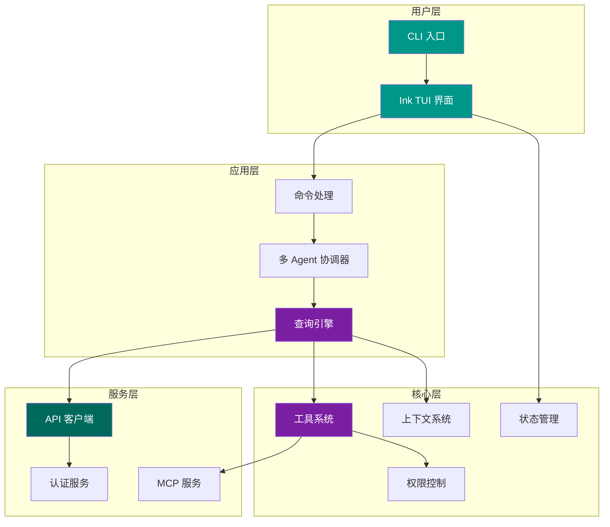

# 架构文档

本节提供 Claude Code 系统级别的架构分析，包括整体架构设计、数据流、组件关系以及关键设计决策的解读。

---

## 整体架构

Claude Code 是一个基于 TypeScript 构建的 AI 编程助手，运行在终端环境中。其整体架构可以分为以下几个层次：

---

## 核心架构特征

### 1. Ink/React 驱动的终端 UI

Claude Code 使用 [Ink](https://github.com/vadimdemedes/ink)（终端版 React）来构建交互界面。这意味着整个 TUI 采用了声明式的组件模型，状态变化自动驱动界面重新渲染。

### 2. 插件化工具系统

工具（Tool）是 Claude Code 与外部世界交互的核心抽象。每个工具：

- 有独立的定义文件
- 声明输入参数的 Schema
- 定义权限需求
- 实现具体的执行逻辑

### 3. 多 Agent 协作

通过 Coordinator 模块，Claude Code 支持将复杂任务拆分为子任务，分发给多个 Agent 并行处理。

### 4. MCP 协议扩展

通过 Model Context Protocol（MCP），用户可以接入外部工具服务器，扩展 Claude Code 的能力边界。

---

## 文档目录

!!! note "持续更新中"
    以下架构文档正在编写中，完成后将添加链接。

- [ ] 整体架构详解
- [ ] 请求生命周期
- [ ] 工具系统架构
- [ ] 多 Agent 架构
- [ ] 终端 UI 架构
- [ ] 权限与安全模型
- [ ] 服务层架构
- [ ] 状态与数据流

---

## 架构图索引

项目 README 中包含了一组架构概览图，可作为快速参考：

| 架构图 | 说明 |
| --- | --- |
| 整体架构 | 系统顶层组件与分层 |
| 请求生命周期 | 用户输入到响应输出的完整流程 |
| 工具系统 | 工具注册、发现、执行的机制 |
| 多 Agent 架构 | Coordinator 与子 Agent 的协作方式 |
| 终端 UI | Ink 组件树与渲染流程 |
| 权限与安全 | 工具调用的权限控制链路 |
| 服务层 | API 客户端、认证、代理等服务 |
| 状态与数据流 | 全局状态的组织与流转方式 |
