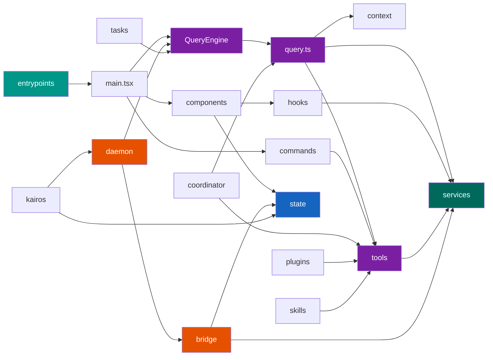

# 模块说明

本节按模块分类，提供 claude-code-best（CLI：`ccb`）源码中各核心模块的详细说明文档。每个模块文档包含：职责说明、对外接口、内部结构、关键实现分析以及与其他模块的依赖关系。

---

## 模块总览

`src/` 目录下包含以下核心模块：

| 模块 | 路径 | 职责 |
| --- | --- | --- |
| **入口** | `entrypoints/`, `main.tsx` | CLI 入口、快速路径分发、Commander.js 主程序 |
| **对话引擎** | `query.ts`, `QueryEngine.ts`, `query/` | Agent 循环、AsyncGenerator 流式、Token 预算 |
| **工具** | `Tool.ts`, `tools.ts`, `tools/` | 58+ 工具定义、注册、组装与执行 |
| **桥接** | `bridge/` (34 文件) | 远程控制、REPL 内嵌桥接、本地桥接 |
| **状态** | `state/` | 类 Zustand 全局状态（AppState，569 行） |
| **命令** | `commands/` | 斜杠命令定义与处理 |
| **服务** | `services/` | API 调用、OAuth、MCP、Voice、analytics |
| **组件** | `components/` | Ink TUI 界面组件 |
| **Hooks** | `hooks/` | React Hooks，管理副作用与状态逻辑 |
| **上下文** | `context/` | 系统提示词、项目上下文构建 |
| **插件** | `plugins/` | 插件加载（builtinPlugins + bundled） |
| **Skills** | `skills/` | Skills 系统（bundled + MCP skill builders） |
| **协调器** | `coordinator/` | 多 Agent 协作（coordinatorMode + workerAgent） |
| **后台守护** | `daemon/` | Supervisor + Worker 进程管理 |
| **Kairos** | `kairos/` | 助手模式引擎（watcher + engine） |
| **UDS Inbox** | `uds/` | Unix Domain Socket 进程间消息收发 |
| **Teleport** | `teleport-local/` | 本地文件快速打包传输 |
| **任务** | `tasks/` | 后台任务类型（Dream / Teammate / Workflow / Monitor 等） |
| **远程** | `remote/` | 远程会话管理 + 权限桥接 |
| **CLI** | `cli/` | 传输层（WS / SSE / Hybrid）、bg 后台会话 |
| **Buddy** | `buddy/` | Companion 小宠物观察器 |
| **Proactive** | `proactive/` | 主动提示引擎 |

---

## 模块依赖关系

---

## 已完成文档

### 核心模块

- [x] [`entrypoints/` + `main.tsx` -- 入口系统](01-entrypoints.md)
- [x] [`query.ts` + `QueryEngine.ts` -- 对话引擎](02-query-engine.md)
- [x] [`Tool.ts` + `tools/` -- 工具系统](03-tool-system.md)
- [x] [`bridge/` -- 远程桥接](04-bridge.md)
- [x] [`state/` -- 状态管理](05-state.md)

### 待编写

- [ ] `services/` -- 服务层（API / OAuth / MCP / Voice）
- [ ] `daemon/` -- 后台守护进程
- [ ] `kairos/` -- 助手模式引擎
- [ ] `coordinator/` -- 多 Agent 协调
- [ ] `plugins/` + `skills/` -- 插件与 Skills
- [ ] `tasks/` -- 后台任务系统
- [ ] `commands/` -- 斜杠命令
- [ ] `components/` + `hooks/` -- UI 层
- [ ] `context/` -- 上下文构建
- [ ] `buddy/` -- Companion 系统
