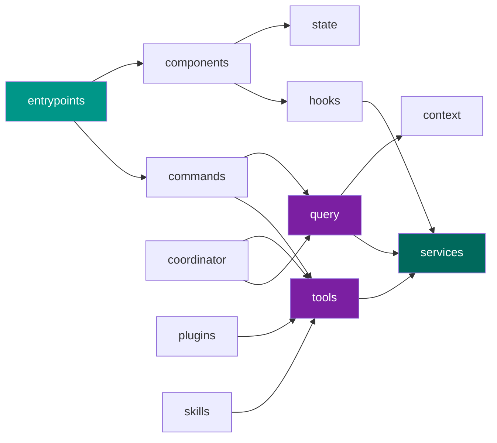

# 模块说明

本节按模块分类，提供 Claude Code 源码中各核心模块的详细说明文档。每个模块文档包含：职责说明、对外接口、内部结构、关键实现分析以及与其他模块的依赖关系。

---

## 模块总览

Claude Code 的 `src/` 目录下包含以下核心模块：

| 模块 | 路径 | 职责 |
| --- | --- | --- |
| **入口** | `entrypoints/` | CLI 入口、print 模式入口等启动文件 |
| **命令** | `commands/` | 斜杠命令的定义与处理 |
| **工具** | `tools/` | 工具系统 — 文件读写、Shell 执行、搜索等 |
| **服务** | `services/` | API 调用、认证、计费等后端服务封装 |
| **组件** | `components/` | Ink TUI 界面组件 |
| **Hooks** | `hooks/` | React Hooks，管理副作用与状态逻辑 |
| **状态** | `state/` | 全局与会话状态管理 |
| **上下文** | `context/` | 系统提示词、项目上下文构建 |
| **插件** | `plugins/` | 插件加载与管理机制 |
| **Skills** | `skills/` | Skills 系统（高层能力抽象） |
| **协调器** | `coordinator/` | 多 Agent 协作与任务分发 |
| **查询** | `query/` | 查询引擎、消息构建、LLM 交互 |
| **工具函数** | `utils/` | 通用辅助函数 |
| **类型** | `types/` | TypeScript 类型定义 |
| **Schemas** | `schemas/` | Zod 校验模式定义 |

---

## 模块依赖关系

---

## 文档进度

!!! note "持续更新中"
    各模块的详细文档正在逐步编写中。已完成的模块文档将在下方列表中添加链接。

---

### 核心模块

- [ ] `entrypoints/` — 入口与启动
- [ ] `tools/` — 工具系统
- [ ] `query/` — 查询引擎
- [ ] `services/` — 服务层

### 交互模块

- [ ] `commands/` — 命令处理
- [ ] `components/` — UI 组件
- [ ] `hooks/` — React Hooks
- [ ] `state/` — 状态管理

### 扩展模块

- [ ] `plugins/` — 插件系统
- [ ] `skills/` — Skills
- [ ] `coordinator/` — 多 Agent 协调
- [ ] `context/` — 上下文构建

### 基础模块

- [ ] `utils/` — 工具函数
- [ ] `types/` — 类型定义
- [ ] `schemas/` — Schema 定义
