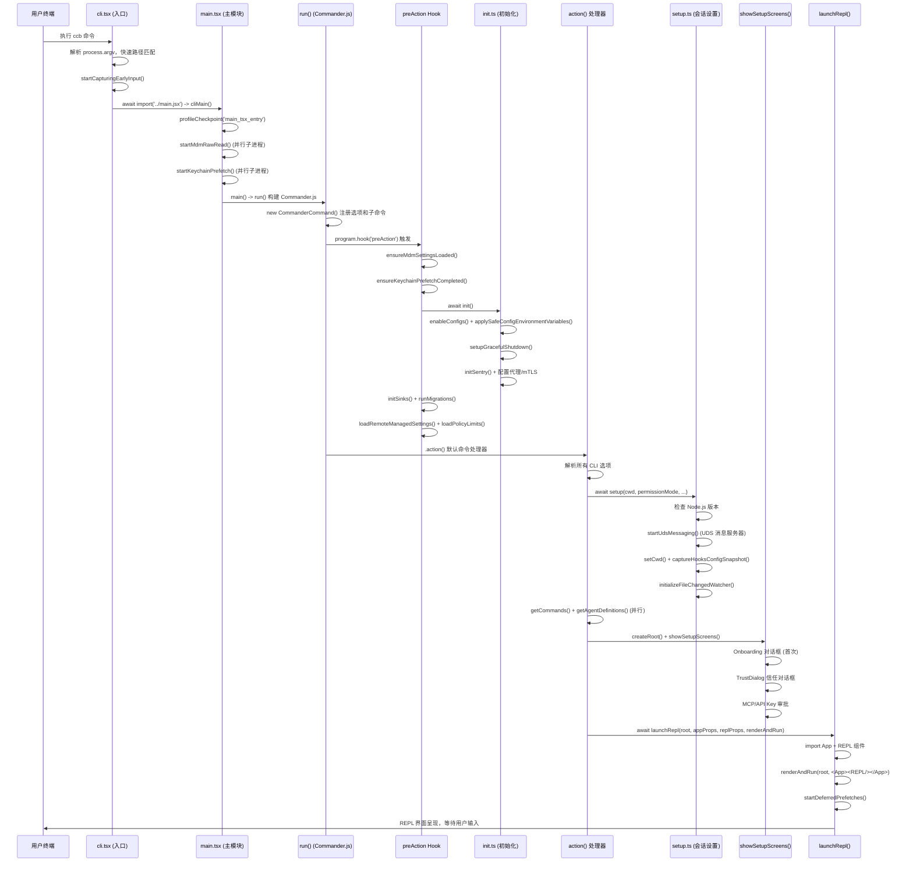

# Claude Code 核心启动流程

本文档逐步骤详细解释从用户在终端输入 `ccb`（或 `claude`）到 REPL 交互界面出现的完整链路。

---

## 启动时序图



---

## 第一步：CLI 入口分发

**文件**: `src/entrypoints/cli.tsx`  
**行号**: 1-321  
**关键函数**: `async function main(): Promise<void>`

### 做了什么

1. **顶层副作用**（行 44-78）：在任何逻辑之前设置环境变量
   - 禁用 corepack 自动固定版本 (`COREPACK_ENABLE_AUTO_PIN = '0'`)
   - CCR 容器环境中限制子进程堆内存为 8GB
   - 消融实验基线：当启用 `ABLATION_BASELINE` 时关闭所有高级功能

2. **快速路径分发**（行 89-317）：`main()` 函数解析 `process.argv` 并按优先级逐一匹配
   - `--version / -v / -V` → 零 import，直接打印版本号后返回
   - `--dump-system-prompt` → 输出渲染后的系统提示词
   - `--claude-in-chrome-mcp` → 启动 Chrome MCP 服务器
   - `--daemon-worker` → 守护进程工作线程
   - `remote-control / bridge` → 本地桥接环境
   - `daemon` → 守护进程 supervisor
   - `ps / logs / attach / kill` → 后台会话管理
   - `new / list / reply` → 模板任务命令
   - `environment-runner` → 无头 BYOC 运行器
   - `--tmux + --worktree` → tmux worktree 模式
   - `--update / --upgrade` → 重定向到 update 子命令
   - `--bare` → 设置 `CLAUDE_CODE_SIMPLE=1`

3. **无匹配 → 加载完整 CLI**（行 311-317）
   ```typescript
   const { startCapturingEarlyInput } = await import('../utils/earlyInput.js');
   startCapturingEarlyInput();
   const { main: cliMain } = await import('../main.jsx');
   await cliMain();
   ```

### 为什么这么做

核心设计理念是 **"快速路径分发"**：对于 `--version` 等简单命令实现零模块加载返回，对各子命令按需动态 `import()`，避免加载完整 CLI 的 ~135ms 开销。只有没有匹配到任何快速路径时，才会加载重量级的 `main.tsx`。

---

## 第二步：主模块加载与顶层副作用

**文件**: `src/main.tsx`  
**行号**: 1-209  
**关键函数**: 模块顶层副作用（无函数签名，import 时执行）

### 做了什么

1. **启动性能分析器**（行 9-12）：
   ```typescript
   profileCheckpoint('main_tsx_entry');
   ```

2. **并行启动子进程**（行 13-20）：
   - `startMdmRawRead()` — 启动 MDM（Mobile Device Management）子进程（`plutil`/`reg query`），与后续 ~135ms 的 import 并行执行
   - `startKeychainPrefetch()` — 并行读取 macOS 钥匙串中的 OAuth 和 API Key 凭据，避免后续串行读取的 ~65ms 开销

3. **大量静态 import**（行 21-200）：加载约 180+ 模块依赖
   - Commander.js 命令行解析库
   - 服务层（analytics、api、mcp、policyLimits 等）
   - 工具集（tools、permissions 等）
   - 配置与认证工具
   - 迁移脚本（migrateSonnet45ToSonnet46 等）
   - React / Ink UI 组件

### 为什么这么做

将 MDM 读取和钥匙串预取放在 import 链最前面，利用 JavaScript 单线程的特性——它们都是子进程异步操作，在后续 ~135ms 的模块评估期间并行完成，到实际需要结果时几乎零等待。

---

## 第三步：main() 函数 — 安全检查与 argv 预处理

**文件**: `src/main.tsx`  
**行号**: 582-853  
**关键函数**: `export async function main()`

### 做了什么

1. **安全防护**（行 588）：
   ```typescript
   process.env.NoDefaultCurrentDirectoryInExePath = '1';
   ```
   防止 Windows 从当前目录执行命令（PATH 劫持攻击）

2. **信号处理**（行 592-603）：注册 `exit` 和 `SIGINT` 处理器

3. **argv 预处理**（行 609-792）：
   - `cc://` URL 重写（Direct Connect 模式）
   - `--handle-uri` 深度链接处理
   - `claude assistant [sessionId]` 参数剥离
   - `claude ssh <host> [dir]` SSH 参数提取与验证

4. **交互模式判断**（行 794-809）：
   ```typescript
   const isNonInteractive = hasPrintFlag || hasInitOnlyFlag || hasSdkUrl || !process.stdout.isTTY;
   setIsInteractive(!isNonInteractive);
   ```

5. **客户端类型识别**（行 814-846）：根据环境变量判断运行环境
   - `github-action`、`sdk-typescript`、`sdk-python`、`claude-vscode`、`remote` 等

6. **调用 run()**（行 851）：
   ```typescript
   await run();
   ```

### 为什么这么做

`main()` 在调用 `run()` 之前完成所有与 Commander.js 无关的预处理——安全设置、特殊 URL 重写、模式判断。这样 `run()` 可以专注于命令行参数的正式解析。

---

## 第四步：run() — Commander.js 程序构建

**文件**: `src/main.tsx`  
**行号**: 881-1003  
**关键函数**: `async function run(): Promise<CommanderCommand>`

### 做了什么

1. **创建 Commander 实例**（行 899）：
   ```typescript
   const program = new CommanderCommand()
     .configureHelp(createSortedHelpConfig())
     .enablePositionalOptions();
   ```

2. **注册 preAction 钩子**（行 904-964）：在任何命令执行前运行初始化
   - 等待 MDM 设置加载和钥匙串预取完成
   - 调用 `await init()` 执行核心初始化
   - 初始化日志 sink
   - 运行数据迁移
   - 加载远程托管设置和策略限制

3. **注册默认命令选项**（行 965-1003）：约 50+ 个 CLI 选项
   - `-p, --print` — 非交互模式
   - `--bare` — 精简模式
   - `-c, --continue` — 继续最近对话
   - `-r, --resume` — 恢复指定会话
   - `--model` — 模型选择
   - `--mcp-config` — MCP 服务器配置
   - `--dangerously-skip-permissions` — 跳过权限检查
   - 等等

4. **注册子命令**（行 3891+）：
   - `mcp` — MCP 服务器管理（serve, add, remove, list, get...）
   - `auth` — 认证管理（login, logout, status）
   - `plugin` — 插件管理（install, uninstall, enable, disable...）
   - `open` — Direct Connect URL 处理

### 为什么这么做

Commander.js 的 `preAction` 钩子确保 `init()` 仅在实际执行命令时运行，而非显示帮助文本时。这避免了 `--help` 路径的不必要初始化开销。

---

## 第五步：preAction — 核心初始化

**文件**: `src/entrypoints/init.ts`  
**行号**: 58-100+  
**关键函数**: `export const init = memoize(async (): Promise<void>)`

### 做了什么

`init()` 被 `memoize` 包装，确保全局只执行一次：

1. **启用配置系统**（行 66）：
   ```typescript
   enableConfigs();
   ```

2. **应用安全环境变量**（行 75）：`applySafeConfigEnvironmentVariables()`
   - 在信任对话框之前只应用安全的环境变量

3. **CA 证书配置**（行 80）：`applyExtraCACertsFromConfig()`
   - 在首次 TLS 连接前加载额外 CA 证书

4. **优雅关闭注册**（行 88）：`setupGracefulShutdown()`

5. **1P 事件日志初始化**（行 95-99）：异步加载 OpenTelemetry 和 GrowthBook

6. **其他初始化**：
   - Sentry 错误追踪初始化
   - MDM 设置同步
   - 代理配置
   - mTLS 配置
   - 仓库检测
   - API 预连接

### 为什么这么做

`init()` 完成应用层面的基础设施初始化——配置、安全、遥测、网络。它通过 `memoize` 保证幂等性，无论被调用几次都只执行一次，让子命令可以安全地依赖它。

---

## 第六步：action() — 默认命令处理器

**文件**: `src/main.tsx`  
**行号**: 1003-2290  
**关键函数**: `.action(async (prompt, options) => { ... })`

### 做了什么

这是 `program.action()` 的回调，是最长的函数之一（约 2800 行）。按顺序执行：

1. **选项解析与验证**（行 1003-1300）：
   - 提取 `debug`、`print`、`model`、`mcpConfig`、`permissionMode` 等
   - 处理 `--bare` 模式
   - 处理 Kairos 助手模式
   - 提取 teammate/worktree/tmux 选项
   - 验证 `--session-id` UUID

2. **权限模式解析**（行 1300-1500）：
   ```typescript
   const permissionMode = initialPermissionModeFromCLI(...)
   ```
   - 处理 `--dangerously-skip-permissions`、`--permission-mode`、默认模式

3. **系统提示词构建**（行 1500-2200）：
   - 加载 `--system-prompt` / `--system-prompt-file`
   - 处理 `--append-system-prompt`
   - 构建 Proactive/Kairos/Coordinator 附加提示词

4. **非交互模式路径**（行 ~1949-2210）：
   - 如果是 `-p/--print` 模式，走 `print.ts` 的无头执行路径

5. **交互模式路径**（行 2210+）：进入第七步

### 为什么这么做

`action()` 是所有交互/非交互逻辑的汇聚点。它必须在 setup() 之前完成所有选项解析，因为 setup() 需要这些参数（权限模式、worktree 配置等）。

---

## 第七步：setup() — 会话环境设置

**文件**: `src/setup.ts`  
**行号**: 56-280+  
**关键函数**:
```typescript
export async function setup(
  cwd: string,
  permissionMode: PermissionMode,
  allowDangerouslySkipPermissions: boolean,
  worktreeEnabled: boolean,
  worktreeName: string | undefined,
  tmuxEnabled: boolean,
  customSessionId?: string | null,
  worktreePRNumber?: number,
  messagingSocketPath?: string,
): Promise<void>
```

### 做了什么

1. **Node.js 版本检查**（行 69-79）：要求 >= 18

2. **自定义 Session ID**（行 82-84）：
   ```typescript
   if (customSessionId) { switchSession(asSessionId(customSessionId)); }
   ```

3. **UDS 消息服务器**（行 89-102）：
   - 在 Mac/Linux 上启动 Unix Domain Socket 消息服务器
   - 导出 `$CLAUDE_CODE_MESSAGING_SOCKET` 环境变量

4. **Teammate 快照**（行 105-109）：捕获团队协作模式的当前状态

5. **终端备份恢复**（行 115-158）：
   - 检查并恢复 iTerm2 / Terminal.app 被中断的设置

6. **工作目录设置**（行 161）：
   ```typescript
   setCwd(cwd);
   ```

7. **Hooks 配置快照**（行 164-169）：
   ```typescript
   captureHooksConfigSnapshot();
   ```

8. **文件变更监视器**（行 172）：
   ```typescript
   initializeFileChangedWatcher(cwd);
   ```

9. **Worktree 创建**（行 176-270）：
   - 如果启用了 `--worktree`，创建 git worktree 分支
   - 可选地创建 tmux 会话

### 为什么这么做

`setup()` 建立会话级别的运行环境——工作目录、消息通道、hooks 监控、worktree。这些必须在命令注册和 UI 渲染之前完成，因为后续步骤都依赖正确的 `cwd` 和 hooks 配置。

### 并行优化

在 `main.tsx` 行 1910-1931 中，`setup()` 与 `getCommands()` 和 `getAgentDefinitions()` 并行执行：

```typescript
const setupPromise = setup(preSetupCwd, permissionMode, ...);
const commandsPromise = worktreeEnabled ? null : getCommands(preSetupCwd);
const agentDefsPromise = worktreeEnabled ? null : getAgentDefinitionsWithOverrides(preSetupCwd);
await setupPromise;
```

`setup()` 的 ~28ms 主要花在 UDS socket 绑定上（非 I/O 密集），所以与 `getCommands()` 的文件读取不冲突。

---

## 第八步：Ink 根节点创建与 Setup 屏幕

**文件**: `src/main.tsx` (行 2215-2238) + `src/interactiveHelpers.tsx` (行 32-240)  
**关键函数**:
```typescript
export function getRenderContext(isAlternateScreen: boolean): {
  renderOptions: RenderOptions;
  getFpsMetrics: () => FpsMetrics | undefined;
  stats: StatsStore;
}

export async function showSetupScreens(
  root: Root,
  permissionMode: PermissionMode,
  allowDangerouslySkipPermissions: boolean,
  commands?: Command[],
  claudeInChrome?: boolean,
  devChannels?: ChannelEntry[],
): Promise<boolean>
```

### 做了什么

1. **创建渲染上下文**（行 2216）：
   ```typescript
   const ctx = getRenderContext(false);
   ```
   获取 FPS 追踪器、统计存储和渲染选项

2. **创建 Ink 根节点**（行 2224-2226）：
   ```typescript
   const { createRoot } = await import('./ink.js');
   root = await createRoot(ctx.renderOptions);
   ```

3. **记录启动时间**（行 2232-2235）：在任何对话框渲染之前记录遥测数据

4. **显示设置屏幕序列**（行 2238）：
   ```typescript
   const onboardingShown = await showSetupScreens(root, permissionMode, ...);
   ```

`showSetupScreens()` 按顺序显示以下对话框（根据条件跳过）：

| 对话框 | 条件 | 文件 |
|--------|------|------|
| Onboarding | 首次运行 | `components/Onboarding.js` |
| TrustDialog | 目录未被信任 | `components/TrustDialog/TrustDialog.js` |
| MCP Server 审批 | 有未审批的 MCP 服务器 | `services/mcpServerApproval.tsx` |
| CLAUDE.md 外部引用审批 | 有外部 includes | `components/ClaudeMdExternalIncludesDialog.js` |
| Grove 策略对话框 | 符合 Grove 资格 | `components/grove/Grove.js` |
| API Key 确认 | 使用自定义 API Key | `components/ApproveApiKey.js` |
| BypassPermissions 确认 | 使用跳过权限模式 | `components/BypassPermissionsModeDialog.js` |
| AutoMode 同意 | 使用 auto 权限模式 | `components/AutoModeOptInDialog.js` |

### 为什么这么做

这些对话框构成了 **信任边界**：在允许任何工具执行或 git 操作之前，必须先确认工作目录的安全性。将它们放在 REPL 启动之前，确保不会在不受信任的环境中执行代码。

---

## 第九步：launchRepl() — REPL 启动

**文件**: `src/replLauncher.tsx`  
**行号**: 1-22  
**关键函数**:
```typescript
export async function launchRepl(
  root: Root,
  appProps: AppWrapperProps,
  replProps: REPLProps,
  renderAndRun: (root: Root, element: React.ReactNode) => Promise<void>,
): Promise<void>
```

### 做了什么

```typescript
export async function launchRepl(root, appProps, replProps, renderAndRun) {
  const { App } = await import('./components/App.js');
  const { REPL } = await import('./screens/REPL.js');
  await renderAndRun(root, <App {...appProps}><REPL {...replProps} /></App>);
}
```

1. **动态加载 App 和 REPL**：延迟加载这两个重量级组件
2. **渲染组件树**：将 `<REPL>` 嵌套在 `<App>` 内
3. **调用 renderAndRun()**：渲染到 Ink 根节点并等待退出

### 为什么这么做

`launchRepl()` 是一个薄薄的"胶水层"，将 `App`（状态管理容器）和 `REPL`（实际界面）组合起来。动态 import 确保这些大组件只在确实需要交互界面时才加载。

---

## 第十步：renderAndRun() — 渲染与等待

**文件**: `src/interactiveHelpers.tsx`  
**行号**: 98-103  
**关键函数**:
```typescript
export async function renderAndRun(
  root: Root,
  element: React.ReactNode,
): Promise<void>
```

### 做了什么

```typescript
export async function renderAndRun(root, element) {
  root.render(element);
  startDeferredPrefetches();
  await root.waitUntilExit();
  await gracefulShutdown(0);
}
```

1. **`root.render(element)`**：将 React 组件树渲染到终端
2. **`startDeferredPrefetches()`**：启动延迟预取（不阻塞首屏渲染）
3. **`await root.waitUntilExit()`**：等待用户退出 REPL
4. **`await gracefulShutdown(0)`**：优雅关闭（刷新遥测、清理资源）

### 为什么这么做

`startDeferredPrefetches()` 被放在首屏渲染之后调用，是刻意的设计：它包含的预取任务（用户信息、tips、模型能力、文件计数等）利用 "用户正在阅读/打字" 的间隙期预热缓存，不影响首屏渲染速度。

---

## 第十一步：REPL.tsx — 主界面

**文件**: `src/screens/REPL.tsx`  
**行号**: 1-100+ (整个文件约 258KB，是代码库中最大的文件)

### 做了什么

REPL 是 Claude Code 的核心交互界面，职责包括：

1. **消息渲染**：展示用户输入和 AI 响应
2. **工具执行管理**：权限请求、工具调用确认
3. **会话状态管理**：通过 AppState 存储追踪对话状态
4. **输入处理**：文本输入、粘贴、Vim 模式、历史搜索
5. **MCP 集成**：管理 MCP 服务器连接
6. **团队协作**：Agent Swarm 的 leader/worker 通信
7. **远程会话**：SSH、Direct Connect、Teleport、Bridge
8. **通知系统**：速率限制、插件更新、模型迁移等

REPL 引用了大量 hooks（位于 `src/hooks/`），包括：
- `useCancelRequest` — 取消请求处理
- `useGlobalKeybindings` — 全局键绑定
- `useInboxPoller` — UDS 收件箱轮询
- `useLogMessages` — 日志消息处理
- 等 80+ 个自定义 hooks

### 为什么这么做

REPL 被设计为一个"大组件"而非拆分为多个小屏幕，因为它需要管理大量交叉依赖的状态（当前消息、工具执行、权限请求、远程连接等）。将这些状态提升到单个组件中避免了复杂的跨组件通信。

---

## 关键性能优化一览

| 优化点 | 文件 | 效果 |
|--------|------|------|
| 快速路径分发 | `cli.tsx` | `--version` 零 import 返回 |
| MDM/钥匙串并行预取 | `main.tsx:13-20` | 与 ~135ms import 并行 |
| setup()/getCommands() 并行 | `main.tsx:1924` | setup ~28ms 与 I/O 并行 |
| 动态 import | `replLauncher.tsx` | App/REPL 仅需要时加载 |
| 延迟预取 | `main.tsx:385` | 首屏后缓存预热 |
| startCapturingEarlyInput | `cli.tsx:311` | 在 main 加载期间捕获按键 |

---

## ASCII 启动流程图（简化）

```
用户输入 ccb
    |
    v
cli.tsx: main()
    |
    +-- 快速路径匹配？ --是--> 处理并返回 (--version, --daemon, 等)
    |
    否
    |
    v
startCapturingEarlyInput()
import('../main.jsx')
    |
    v
main.tsx: 顶层副作用
  - startMdmRawRead()      ─┐
  - startKeychainPrefetch() ─┤ 与下面 import 并行
  - ~180 个 import 加载     ─┘
    |
    v
main(): 安全检查 + argv 预处理
    |
    v
run(): Commander.js 构建
    |
    +--> preAction hook:
    |      init() -> enableConfigs, 安全, 遥测, 代理
    |      initSinks(), runMigrations()
    |
    v
.action(): 默认命令处理
    |
    +-- 非交互? --是--> print.ts (无头执行)
    |
    否
    |
    v
setup(): cwd, UDS, hooks, worktree
    |  (并行: getCommands + getAgentDefinitions)
    v
createRoot() -> Ink 根节点
    |
    v
showSetupScreens():
    Onboarding -> TrustDialog -> MCP审批 -> ...
    |
    v
launchRepl() -> renderAndRun()
    |
    v
<App><REPL /></App> 渲染到终端
    |
    v
startDeferredPrefetches() (后台)
    |
    v
REPL 界面就绪，等待用户输入
```

---

## 错误处理与退出

- **SIGINT**（Ctrl+C）：在交互模式下直接 `process.exit(0)`；在 print 模式下由 `print.ts` 的处理器接管
- **未处理异常**：通过 Sentry 上报（`init.ts` 中初始化）
- **优雅关闭**：`gracefulShutdown()` 确保遥测数据刷新、LSP 服务器关闭、cleanup 回调执行
- **启动失败**：`exitWithError()` 通过 Ink 渲染错误消息后 unmount 并退出

---

## 附录：启动 Profile Checkpoint 列表

以下是启动过程中的性能检查点（按时间顺序）：

1. `cli_entry` — CLI 入口（非 --version 路径）
2. `cli_before_main_import` — 开始加载 main.tsx
3. `cli_after_main_import` — main.tsx 加载完成
4. `main_tsx_entry` — main.tsx 模块评估开始
5. `main_tsx_imports_loaded` — 所有 import 加载完成
6. `main_function_start` — main() 函数开始执行
7. `main_warning_handler_initialized` — 警告处理器就绪
8. `main_client_type_determined` — 客户端类型确定
9. `main_before_run` — 即将调用 run()
10. `run_function_start` — run() 函数开始
11. `run_commander_initialized` — Commander 实例创建完成
12. `preAction_start` — preAction 钩子开始
13. `preAction_after_mdm` — MDM 设置加载完成
14. `preAction_after_init` — init() 完成
15. `preAction_after_sinks` — 日志 sink 初始化完成
16. `preAction_after_migrations` — 数据迁移完成
17. `preAction_after_remote_settings` — 远程设置加载启动
18. `action_handler_start` — 默认命令处理器开始
19. `action_before_setup` — 即将调用 setup()
20. `action_after_setup` — setup() 完成
21. `cli_after_main_complete` — 整个 main 流程结束
