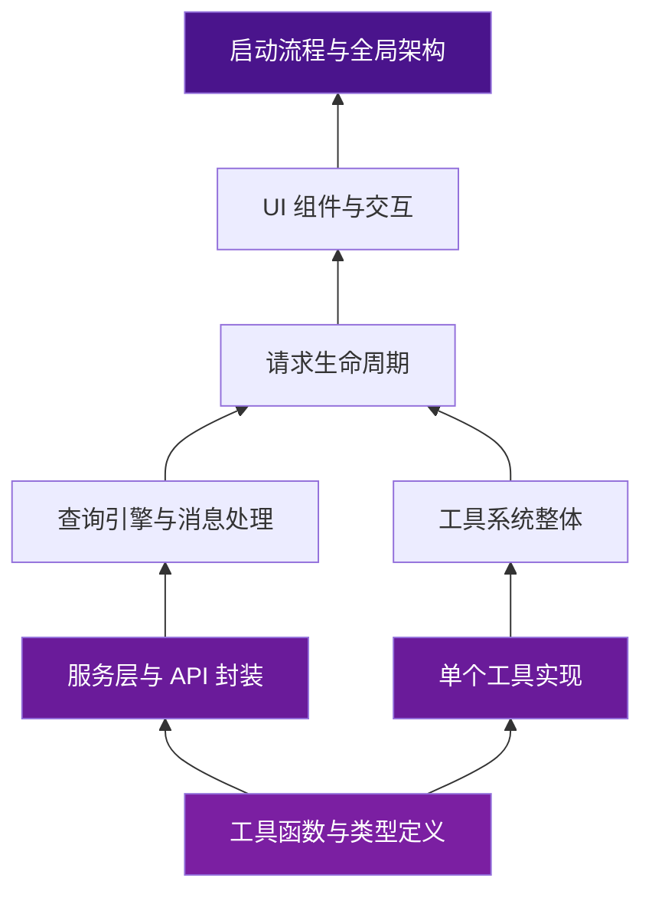

# 从基础到全貌 — 自底向上理解 Claude Code

!!! info "阅读建议"
    本教程适合希望**从具体代码入手，逐步构建全局理解**的读者。如果你更喜欢先建立宏观认知，可以参考 [自顶向下教程](../top-down/index.md)。

---

## 教程概述

自底向上的学习路径从 Claude Code 最基础、最独立的模块开始，逐步向上构建对整体系统的理解。每一步都以可运行的代码为锚点，通过阅读和调试真实代码来加深理解。

这种方式的优势在于：

- **脚踏实地** — 每一步都基于具体代码，理解扎实
- **可动手验证** — 随时可以修改代码、观察行为变化
- **渐进式理解** — 不会因为信息量过大而迷失方向

---

## 学习路线



### 第一层：基础构件

从最小、最独立的代码单元开始：

1. **类型定义与常量** — `types/`、`constants/` 中的核心类型
2. **工具函数** — `utils/` 中的独立辅助函数
3. **Schema 定义** — `schemas/` 中的 Zod 校验模式

### 第二层：独立模块

理解可独立工作的功能模块：

4. **单个工具剖析** — 以 `tools/` 中的一个具体工具为例，完整理解工具的定义、注册与执行
5. **服务层** — `services/` 中的 API 调用封装与认证逻辑
6. **状态管理** — `state/` 中的状态容器设计

### 第三层：系统组装

理解模块之间如何组合协作：

7. **工具系统全貌** — 工具注册表、工具发现、权限校验的完整流程
8. **查询引擎** — `query/` 中的消息构建与 LLM 交互
9. **请求生命周期** — 从输入到输出的完整数据流

### 第四层：全局视角

从整体视角理解系统设计：

10. **UI 组件树** — Ink 组件的组织与渲染机制
11. **启动流程** — 应用初始化的完整链路
12. **架构全貌** — 回顾整体，串联所有知识点

---

## 前置知识

为了更好地跟随本教程，建议具备以下基础：

- [x] TypeScript 基本语法
- [x] 了解 ES Module 的导入导出
- [x] 基本的命令行操作能力
- [ ] React — 后半部分会用到，届时会介绍
- [ ] Bun 运行时 — 会在教程中介绍

---

## 推荐的实践方式

!!! tip "边读边跑"
    建议在本地克隆项目后，配合教程一起阅读源码：

    ```bash
    git clone https://github.com/anthropics/claude-code.git claude-code-haha
    cd claude-code-haha
    bun install
    ```

    在阅读每个章节时，尝试：

    1. 打开对应的源码文件
    2. 添加 `console.log` 观察运行时行为
    3. 修改代码，验证自己的理解

---

!!! tip "即将发布"
    各章节内容正在编写中，敬请期待。完成后将在此页面更新链接。
