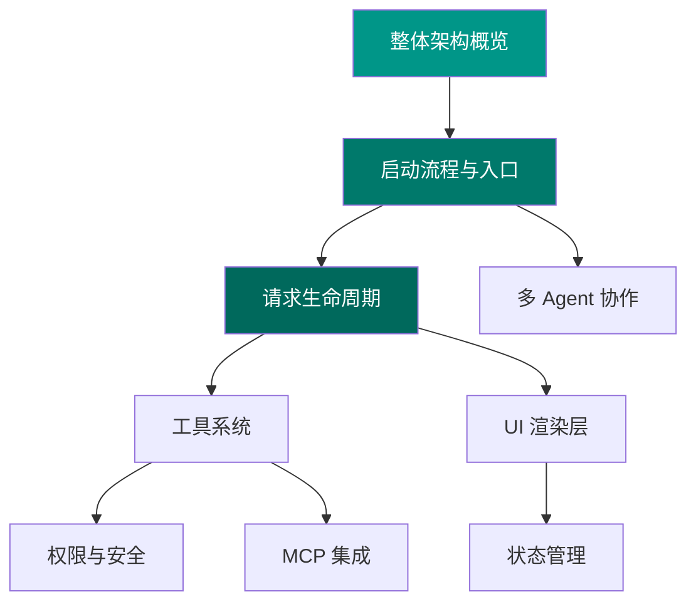

# 从全局到细节 — 自顶向下理解 Claude Code

!!! info "阅读建议"
    本教程适合希望**先建立全局认知，再逐步深入细节**的读者。如果你更喜欢从具体代码入手，可以参考 [自底向上教程](../bottom-up/index.md)。

---

## 教程概述

自顶向下的学习路径从 Claude Code 的整体架构出发，先理解系统的宏观结构与核心设计理念，然后逐层拆解每个子系统的职责与交互方式，最终深入到具体的代码实现。

这种方式的优势在于：

- **先见森林，再见树木** — 始终在全局视角下理解局部实现
- **理解设计意图** — 知道每个模块"为什么"存在，而非仅仅知道它"做了什么"
- **高效定位** — 遇到问题时能快速判断应该关注哪个层次

---

## 学习路线

### 第一层：宏观架构

从最高层次理解 Claude Code 的系统组成：

1. **整体架构概览** — 核心子系统划分、数据流向、依赖关系
2. **启动流程分析** — 从 `bun run` 到界面显示的完整链路

### 第二层：核心流程

深入理解用户交互的核心路径：

3. **请求生命周期** — 用户输入 → LLM 调用 → 工具执行 → 结果渲染
4. **UI 渲染机制** — Ink/React 驱动的终端 TUI 实现

### 第三层：关键子系统

逐个拆解核心子系统的设计与实现：

5. **工具系统（Tool System）** — 插件化工具注册、发现、执行
6. **权限与安全模型** — 工具调用的权限控制与沙箱机制
7. **MCP 协议集成** — Model Context Protocol 的接入与扩展
8. **状态管理** — 全局状态、会话状态的组织方式
9. **多 Agent 协作** — Coordinator 与子 Agent 的协作机制

---

## 前置知识

为了更好地跟随本教程，建议具备以下基础：

- [x] TypeScript 基本语法
- [x] React 组件模型基本概念
- [x] 对 LLM API 调用流程有基本了解
- [ ] Ink（终端 React 框架）— 会在教程中介绍
- [ ] MCP 协议 — 会在教程中介绍

---

!!! tip "即将发布"
    各章节内容正在编写中，敬请期待。完成后将在此页面更新链接。
